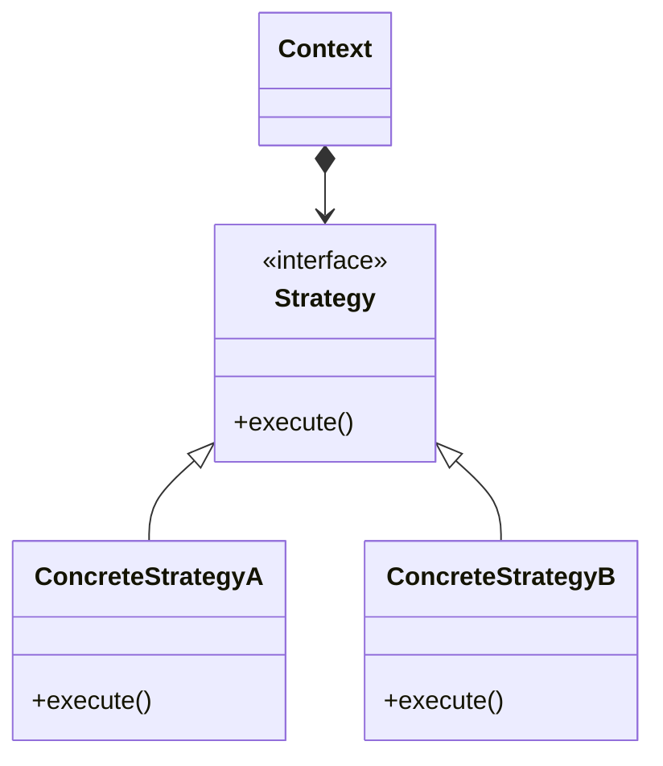
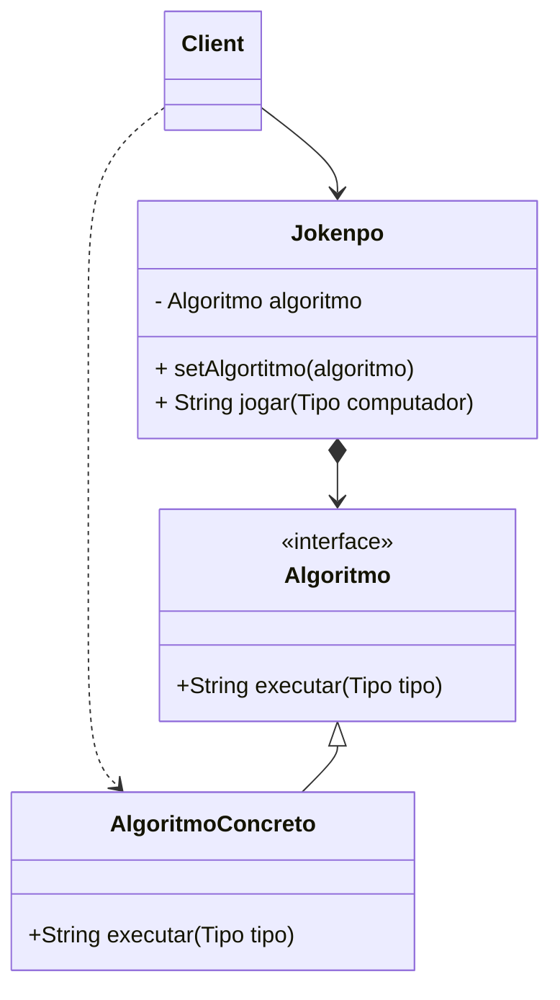

# Desafio JoKenPo The Big Bang Theory


## Descrição da Atividade

Para este desafio vocês deverão utilizar os conhecimentos adquiridos para resolver da melhor forma possivel uma partida de Jokenpo com a variação que contenha o Lagarto e Spock, conforme a ilustração acima.

Utilizem a linguagem de sua preferencia e o paradigma de programação ao qual esteja mais confortável.


## Primeira Resolução com Paradigma estruturado.

> Programação Clássica

```java
public class Main {

    public static void main(String[] args) {
        Scanner in = new Scanner(System.in);
        System.out.println("Escolha uma das opções [ 1-PAPEL, 2-TESOURA, 3-PEDRA, 4-LAGARTO, 5-SPOCK ]\n");
        int jogada = in.nextInt();
        int computador = new Random().nextInt(5) + 1;
        System.out.println("O COMPUTADOR escolheu: " + computador);

        if (jogada == 1 && computador == 1) {
            System.out.println("Empate. Papel empata com papel!");
        } else if (jogada == 1 && computador == 2) {
            System.out.println("Perdeu! Tesoura corta o papel!");
        } else if (jogada == 1 && computador == 3) {
            System.out.println("Ganhou! Pedra embrulha o papel!");
        } else if (jogada == 1 && computador == 4) {
            System.out.println("Perdeu! Lagarto come o papel!");
        } else if (jogada == 1) {
            System.out.println("Ganhou! Papel refuta o Spock!");
        } else if (jogada == 2 && computador == 1) {
            System.out.println("Ganhou. Tesoura corta o papel!");
        } else if (jogada == 2 && computador == 2) {
            System.out.println("Empate! Tesoura empata com tesoura!");
        } else if (jogada == 2 && computador == 3) {
            System.out.println("Perdeu! Pedra quebra a tesoura!");
        } else if (jogada == 2 && computador == 4) {
            System.out.println("Ganhou! Tesoura decapta o lagarto!");
        } else if (jogada == 2) {
            System.out.println("Perdeu! Spock derrete a tesoura!");
        } else if (jogada == 3 && computador == 1) {
            System.out.println("Perdeu. Papel embrulha a pedar!");
        } else if (jogada == 3 && computador == 2) {
            System.out.println("Empate! Tesoura empata com tesoura!");
        } else if (jogada == 3 && computador == 3) {
            System.out.println("Empatou! Pedra empata com pedra!");
        } else if (jogada == 3 && computador == 4) {
            System.out.println("Ganhou! Pedra esmaga o lagarto!");
        } else if (jogada == 3) {
            System.out.println("Perdeu! Spock vaporiza a apedra!");
        } else if (jogada == 4 && computador == 1) {
            System.out.println("Ganhou. Lagarto come papel!");
        } else if (jogada == 4 && computador == 2) {
            System.out.println("Perdeu! Tesoura decapta o lagarto!");
        } else if (jogada == 4 && computador == 3) {
            System.out.println("Perdeu! Pedra esmaga lagarto!");
        } else if (jogada == 4 && computador == 4) {
            System.out.println("Empatou! Lagarto empata com lagarto!");
        } else if (jogada == 4) {
            System.out.println("Ganhou! Lagarto envenena o Spock!");
        } else if (jogada == 5 && computador == 1) {
            System.out.println("Perdeu. Papel refuta Spock!");
        } else if (jogada == 5 && computador == 2) {
            System.out.println("Ganhou! Spock derrete a tesoura!");
        } else if (jogada == 5 && computador == 3) {
            System.out.println("Ganhou! Spock vaporiza a pedra!");
        } else if (jogada == 5 && computador == 4) {
            System.out.println("Perdeu! Lagarto envenena Spock!");
        } else if (jogada == 5) {
            System.out.println("Empatou! Spock empata com Spock!");
        }

        in.close();
    }
}
```

# Utilizando o Design Pattern Strategy



# Strategy aplicada ao JoKenPo

Implementação do algoritmo parcial com base no Padrão Strategy.

